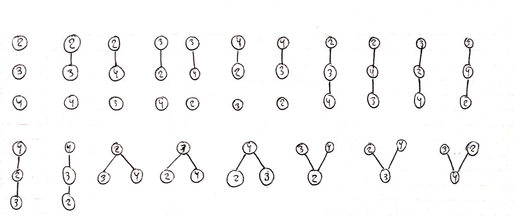
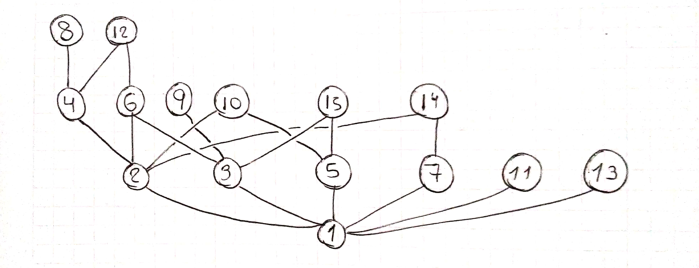
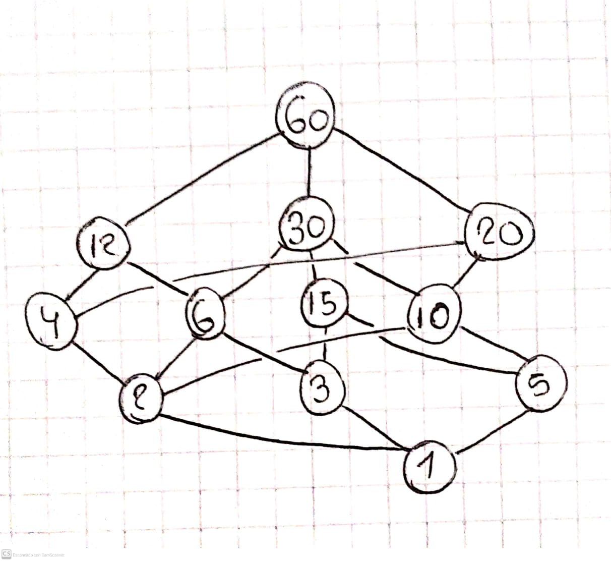
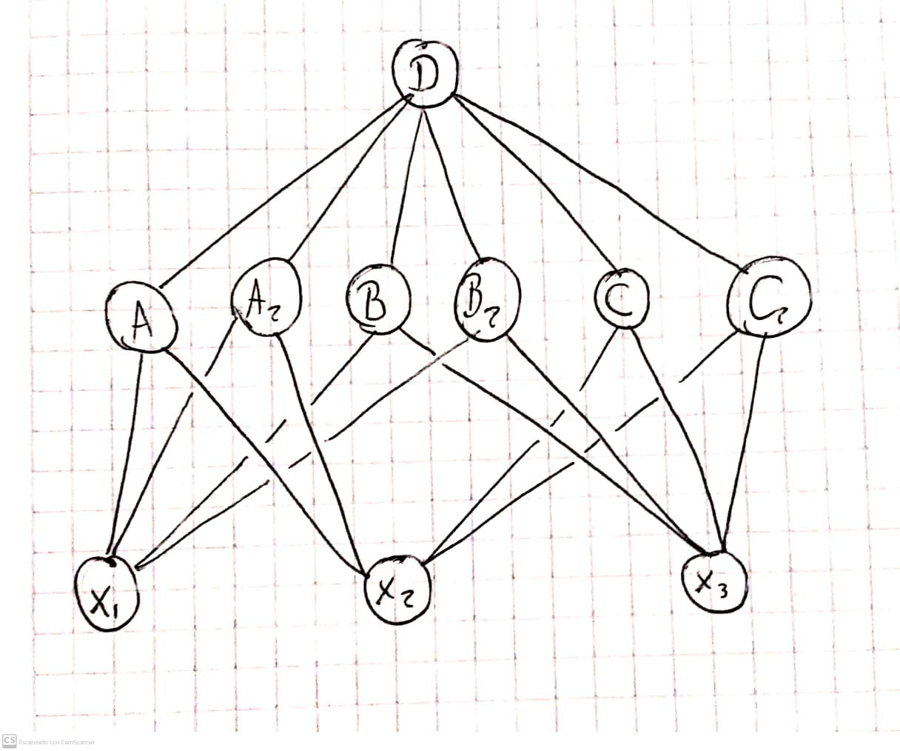

# Guía 2: ejercicios

## Ejercicio 1

### Item A

Impreciso. ¿Qué sería $\{1\leq 2\leq 3\}$ ?

### Item B

Verdadero. En particular, se cumple que $(0.2,0.2)\in R_{(E1)}$ pero $(0.2,0.2)\notin R_{(E4)}$.

### Item C

Falso. En particular, no cumple con reflexividad en $R$ dado que no se cumple $0.2\ R\ 0.2$.

### Item D

Falso porque no se cumple para todo $A$. En particular, no se cumple para $A:|A|\leq 1$.

### Item E

Verdadero, dado que un orden parcial es una relación binaria, la cual es un conjunto de 2-uplas.

### Item F

Verdadero. Es trivial de ver dado que:

- Reflexividad: $x|x\forall x\in\mathbb{Z}$
- Transitividad: $x|y\wedge y|z\Rightarrow x|z\forall x,y,z\in\mathbb{Z}$
- Antisimetría: $x|y\wedge y|x\Rightarrow x=y\forall x,y\in\mathbb{Z}$

## Ejercicio 2

### Item A

Falso dado que la definición requiere que el universo sea no vacío.

### Item B

Verdadero dado que $\{(\emptyset,\emptyset)\}$ es un orden parcial (y total) sobre $\{\emptyset\}$.

### Item C

Impreciso. ¿Qué es $\{1<2\}$ ?

### Item D

Impreciso. ¿Por qué está entre corchetes?

### Item E

Falso. $A\times A$ no es un orden parcial dado que no cumple la asimetría si $|A|>1$ (al tener todas las relaciones posibles).

### Item F

Verdadero. Misma idea que en (b).

### Item G

Falso. Misma idea que en (e).

## Ejercicio 3

Para dar estos posets, vamos a dar su diagrama de Hasse:

## Ejercicio 3,3

## Ejercicio 3,6

Notemos que $S=\{1,2,3,4,5,6,10,12,15,20,30,60\}$

## Ejercicio 4

Digamos que tenemos $x,y\in P:x\leq y\wedge x\not\lt y$.

Luego, dada la definición de $\not\lt$, tenemos entonces que $\neg(x\leq y\wedge x\neq y)\equiv x\not\leq y\lor x=y$. Dado esto, entonces, y en base a nuestra suposición ($x\leq y$ ), tenemos que $x=y$ por lo que se demuestra.

Como esto se hizo para cualquier $x,y\in P$ que cumpla las condiciones iniciales del enunciado, entonces se demuestra totalmente. $\blacksquare$

## Ejercicio 4,3

Lo demostremos por el absurdo y supongamos que no se cumple. Luego, esto significa que $\forall a, b\in P:a\neq b$ se debería cumplir que $a\leq b\wedge b\leq a$. Sin embargo, esto significa que $a=b$ (por antisimetría) y eso es absurdo dado que $a\neq b$.

Como este absurdo vino de suponer que el enunciado no se cumple, demostramos de este modo que sí es verdadero. Así mismo, se demuestra en su totalidad al hacerlo para todo $a,b\in P:a\neq b$. $\blacksquare$

## Ejercicio 5

### Item A

Falso. Puede darse el caso en que no tengan ningún tipo de relación como lo es con $\leq = \{(x,x):x\in P\}$.

### Item B

Falso. Mismo que en (a)

### Item C

Verdadero. Es trivial de ver.

### Item D

Verdadero. Hay dos casos para ver:

- Si $a\prec b$, es trivial ver que $z=b$ y se cumple.
- Si $a\not\prec b$, entonces como $a\lt b$ sabemos que $\exists z\in P:a\prec z$, por lo que también se cumple.

### Item E

Falso. Puede ir con la misma idea que (a) de que no tienen conexión.

### Item F

Verdadero. En particular, primero notemos que como $A,B$ son conjuntos y $A\leq B\iff A\subseteq B$, entonces claramente el "cubrimiento" se da agregando un elemento más al conjunto. Es decir, $A\prec B\iff B=A\cup {b}:b\in B-A$.

### Item G

Verdadero, ya que al ser un conjunto totalmente ordenado, entonces todos los elementos se relacionan.

### Item H

Falso. Si $P=\{x\}$, entonces no se cumple claramente.

### Item I

Falso. Si $P=\{1,2,3\}$ y $\leq=\{(1,1),(2,2),(3,3),(1,2),(1,3)\}$, entonces $1\prec 2\wedge 1\prec 3$, por lo que no se cumple.

## Ejercicio 5,5

Es trivial de demostrar dado que si $b$ tapa a $a$, entonces significa que $a\lt b$ y $b\leq c\forall c\in P:a\leq c$. Luego, entonces, se cumple que $\nexists z\in P:a\lt z\lt b$, por lo que por definición tenemos que $a\prec b$. $\blacksquare$

La demo de que la recíproca no es cierta se puede hacer por contraejemplo pensando en $P=\{1,2,3,4\}$ y $\leq=\{(1,1),(2,2),(3,3),(4,4),(1,2),(1,3),(2,4),(3,4)\}$ dado que $1\prec 2\wedge 1\prec 3\wedge 1\not\prec 4$ y $4$ es el único elemento que tapa a $1$. $\blacksquare$

## Ejercicio 6

Supongamos que $(P,\leq)$ tiene máximos $a$ y $b$. Luego, por definición se cumpliría que $a\leq b\wedge b\leq a$, por lo que por antisimetría tendríamos que $a=b$. Finalmente, se demuestra que los posets tienen a lo sumo un máximo. $\blacksquare$

## Ejercicio 6,3

Por el diagrama de Hasse que hicimos en el ejercicio (3,3), podemos ver que:

- Maximales: $8,12,9,10,15,14$
- Minimales: $2,3,5,7,11,13$

## Ejercicio 6,6

Si $\omega=\emptyset$, entonces sería impreciso porque no se puede definir un poset con un universo vacío.

Caso contrario, si $|\omega|\gt 0$, entonces es sencillo notar que los maximales $M$ son tales que $\exists x\in\omega:\omega=M\cup\{x\}$. Es decir, son todas las $|\omega|$ posibilidades quitándole **solo uno** de los elementos a $\omega$.

## Ejercicio 7

Trivial. Sale de la misma definición. $\blacksquare$

## Ejercicio 8

### Item A

Falso, porque puede no tener máximo pero sí maximales.

### Item B

Verdadero, porque siempre existiría un elemento mayor a cualquiera que consideres. De forma inductiva se ve que es infinito.

## Ejercicio 9

Notemos que por definición, entonces ambos son cota superiores de $S$ y también cumplen que:

- $\forall b\in P$, $b$ es cota superior de $S$ en $(P,\leq)\Rightarrow a\leq b$
- $\forall b\in P$, $b$ es cota superior de $S$ en $(P,\leq)\Rightarrow a'\leq b$

Luego, claramente tenemos $a\leq a'\wedge a'\leq a$, por lo que por antisimetría, $a=a'$ y se demuestra. $\blacksquare$

## Ejercicio 10

### Item A

Es trivial de ver que $a\leq b\Rightarrow sup(\{a,b\})=b$

### Item B

Es trivial ver que ese conjunto es $P$.

### Item C

Es trivial ver que es cierto.

## Ejercicio 11

## Ejercicio 12

Como $a=sup(S)$, entonces es cota superior de $S$ en $(P,\leq)$ y $\forall b\in P$, $b$ cota superior de $S$ en $(P,\leq)\Rightarrow a\leq b$.

Como consecuencia, es claro ver que lo mismo pasa con $S\cup\{a\}$. $\blacksquare$

## Ejercicio 13

La ida se demuestra viendo que el máximo en este caso es la única cota superior de $P$, por lo que cumple con la definición de supremo.

La vuelta se demuestra viendo que si es el supremo de $P$, entonces es cota superior de $P$, por lo que es maximal. Luego, como tenemos la condición de ser la cota superior más grande de todas, entonces esto significa que "están relacionados" estos elementos, por lo que tiene que ser $1$ solo, resultando en ser el máximo.

Con esto, se demuestra. $\blacksquare$

## Ejercicio 14

### Item A

Falso. No es necesario que $a\in S$ para que sea el supremo. El contraejemplo puede ser $D$ que es $sup(\{x_1,x_2,x_3\})$ del ejercicio 11.

### Item B

Falso. Por contraejemplo viendo el ejercicio 11 dado que $A,A_2$ son cotas superiores de $\{x_1,x_2\}$ pero, a su vez, ambos cubren a $x_1,x_2$.

## Ejercicio 14,5

Si existe $sup(\{a,b\})$, entonces esto significa que $a\leq b$ o $b\leq a$. Luego, es sencillo notar que:

- Si $sup(S)\leq b$, $sup(S\cup\{b\})=b$
- Si $b\leq sup(S)$, $sup(S\cup\{b\})=sup(S)$

Luego, como $sup(S)=a$, llegamos a que $sup(S\cup\{b\})=sup(\{a,b\})$. $\blacksquare$

## Ejercicio 15

Análogo al ejercicio 9

## Ejercicio 16

Análogo al ejercicio 10

## Ejercicio 17

El ínfimo de $S$ es $0$, y el ínfimo de $\{x\in\mathbb{Q}:2\lt x\leq 5\}$ es $2$ en $(P,\bar{\leq})$

## Ejercicio 18

Notemos que en este ejercicio $D((x_0,y_0),r)$ es el conjunto de puntos contenido en el círculo de radio $r$ cuyo centro es $(x_0,y_0)$.

Digamos que $A=D((-2,0),4), B=D((2,0),4)$. Luego, consideremos el siguiente lema:

- Si $C\in P-\{\emptyset\}:C\subseteq A\cup B\Rightarrow \exists C'\in P-\{\emptyset\}:C'\subseteq A\cup B\wedge C\cap C'=\emptyset$

Esto es trivial de ver dado que los círculos son infinitos, en cualquier posición y de cualquier tamaño.

Teniendo esto en cuenta, ahora vamos a demostrar por el absurdo que no siempre existe el ínfimo. Supongamos que existe y $C=inf(A,B)$.

Claramente, $C\neq\emptyset$. Ahora, por el lema anterior, tenemos $C':C\cap C'=\emptyset$ y $C'\subseteq A\cup B$. Luego, esto significa que $C'$ es cota inferior de $\{A,B\}$, por lo que $C'\subseteq C$. Sin embargo, esto significa que $C'=\emptyset$, lo cual es absurdo.

Finalmente, se demuestra que esta afirmación es falsa y no siempre existe el ínfimo en este caso. $\blacksquare$.

## Ejercicio 18,5

Consideremos $P=\{1,2\}$ y $P'=\{1\}$ y donde $\leq,\leq'$ son los órdenes usuales. Luego, consideremos:

$$
\begin{aligned}
    F&:P\to P'\\
    F(x)&=1\forall x\in P
\end{aligned}
$$

El cual es un homomorfismo de $(P,\leq)$ en $(P',\leq)$ dado que $\forall x,y\in P, x\leq y\Rightarrow F(x)\leq' F(y)$ (ya que $1\leq 1$ ).

## Ejercicio 19

Consideremos $P=P'=\{1,2\}$ donde $\leq=\{(1,1),(2,2)\}$ y $\leq'=\{(1,1),(2,2),(1,2)\}$. Luego, $F:P\to P'$ tal que $F(x)=x\forall x\in P$ es un homomorfismo biyectivo que no es isomorfismo. Esto es así dado que $F^{-1}$ no es un homomorfismo.

## Ejercicio 20

No la voy a hacer

## Ejercicios 21 - 21,3

Trivial al notar que si dos posets finitos son isomorfos, entonces tienen la misma representación con el diagrama de Hasse. No voy a hacer la demo.

## Ejercicio 21,5

### Item A

El homomorfismo mantiene las relaciones $\leq$ entre los elementos y sus correspondientes con la transformación por $F$. Luego, si el conjunto es totalmente ordenado, entonces todos los elementos se relacionan, por lo que sus correspondientes también y, por ello, forman un conjunto totalmente ordenado. Ahora bien, como $F$ es suryectiva, esto implica que se utilizan todos los elementos de $P'$ para la transformación, por lo que el conjunto totalmente ordenado es $P'$. $\blacksquare$

### Item B

Al mantenerse las relaciones como anteriormente dijimos, se cumple que, sea $x=1_P$ (el máximo), entonces $\forall y\in P, y\leq x$. Luego, por definición de homomorfismo, $\forall y\in P, F(y)\leq F(x)$, por lo que es máximo. Luego, se demuestra. $\blacksquare$

## Ejercicio 22

### Item A

Falso. Por contraejemplo, podríamos tener $P=\{1,2\}$ con $\leq=\{(1,1),(2,2),(1,2)\}$ y $\leq'=\{(1,1),(2,2),(2,1)\}$ donde $F:P\to P$ con $F(1)=2$ y $F(2)=1$.

### Item B

Falso. Por contraejemplo, dado que $P=\{1,2\}$ con $\leq=\{(1,1),(2,2)\}$ también lo cumple y $|P|\neq 1$.

### Item C

Falso. Por contraejemplo, dado que $P=\{1,2\},P'=\{1,2\}$ con $\leq=\{(1,1),(2,2)\}$ y $\leq'=\{(1,1),(2,2),(1,2)\}$ donde $F:P\to P'$ tal que $F(x)=x\forall x\in P$, cumple que $P'$ tiene máximo pero $P$ no.
