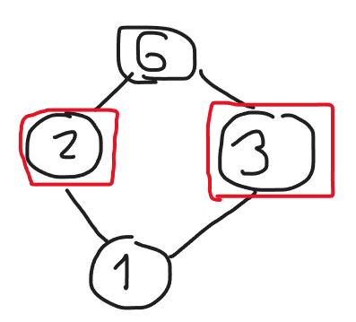
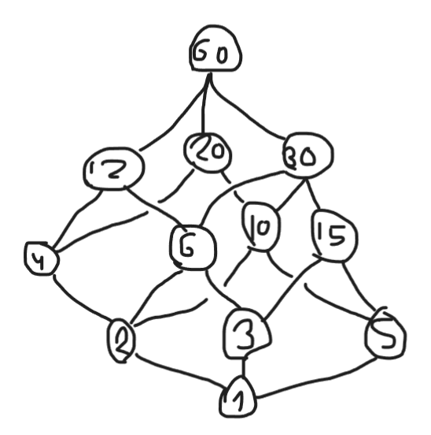

# Guía 3: ejercicios

## Ejercicio 1

Los únicos posibles reticulados par cuyo universo es $\{2,3,4\}$ son aquellos tales que se cumple alguna de las siguientes:

- $2\leq 3\leq 4$
- $2\leq 4\leq 3$
- $3\leq 2\leq 4$
- $3\leq 4\leq 2$
- $4\leq 2\leq 3$
- $4\leq 3\leq 2$

Agregando, obvio, las relaciones reflexivas $2\leq 2,3\leq 3,4\leq 4$.

## Ejercicio 2

Trivial. Notemos que en este ejercicio se cumple que $\forall A,B\in\mathcal{P}(\omega),sup(\{A,B\})=A\cup B$ e $inf(\{A,B\})=A\cap B$.

## Ejercicio 2,5

Su mínimo sí existe y es $1$. Respecto al máximo, este no tiene.

Sin embargo, cumple con el hecho de ser reticulado par porque $\forall a,b\in\mathbb{N}, sup(\{a,b\})=mcm(a,b)\wedge inf(\{a,b\})=mcd(a,b)$, los cuales pertenecen al universo $\mathbb{N}$.

## Ejercicio 3

El item A es trivial y el B sale del primero dado que todo par de elementos del universo tiene un orden, por lo que su supremo está definido y existe.

## Ejercicio 4

### Item A

Verdadero. Trivial de ver dado que $\forall a,b\in\{1\},sup(\{a,b\})=inf(\{a,b\})=1$ por lo que existe.

### Item B

Verdadero. Como es un reticulado par, entonces podemos considerar iterativamente tener un elemento $x\in P$ e $y\in S$ de modo que $sup(\{x,y\})$ existe por definición. La iteración comienza con algún $x\in S$, siendo los $y$ siempre distintos en cada "ronda" y siendo el supremo el próximo valor $x$. Con esto, se ve por inducción que el supremo de $S$ existe (tomando todos los elementos de este conjunto de a pares con el valor actual del supremo calculado).

### Item C

Falso. Digamos que tenemos el reticulado par $(P,\leq)$ cuyo diagrama de Hasse es:

Luego, si $S=\{2,3\}$, claramente no se cumple que $(S,\leq\cap S^2)$ sea un reticulado par porque no existe $sup(\{2,3\})$ en $S$.

### Item D

Verdadero. Como $(S,\leq\cap S^2)$ también es un reticulado par, entonces esto significa que dado $a,b\in S$, existe $inf(a,b)\in S$. Luego, extendiendo la definición para $P$, es trivial notar que $inf(a,b)\in P$ refiere al mismo elemento de $S$.

### Item E

Falso. Notar que como $\mathbb{N}$ no es un elemento del universo, entonces las cotas superiores de $\{\mathbb{N}-\{1\},\{1\}\}$ son $\mathbb{N}\cup\{x\}:x\in\mathbb{R}-\mathbb{N}$, y tales que no tienen relación entre sí según $\subseteq$. Luego, es claro que no hay ninguna de estas cotas superiores que sea el supremo de $\{\mathbb{N}-\{1\},\{1\}\}$ por lo que no se cumple con la definición de reticulado par.

## Ejercicio 5

$mcm$ y $mcd$ respectivamente para $s$, $i$.

## Ejercicio 6

$\cup$ y $\cap$ respectivamente para $s$, $i$

## Ejercicio 7

Trivial viendo que $s=mcm$ y que $i=mcd$. El diagrama de Hasse de $(D_{60},\leq_{60})$ es el siguiente:

## Ejercicio 8

No. Un ejemplo es $inf(\{\{1,2,3\},\{2,3,4\}\})=\{2,3\}$ pero que no cumple si $P=\{\{1,2,3\},\{2,3,4\},\{2\}\}$ dado que el ínfimo, en este caso, sería $\{2\}$.

## Ejercicio 9

No. Análogo al ejercicio 8.

## Ejercicio 10

Supongamos que $m$ no es un elemento máximo de $(P,\leq)$ pero sí maximal. Luego, existe $m'\in P$ que también es maximal. Por definición de reticulado par tenemos que $sup(\{m,m'\})$ existe, por lo que o bien $m\leq m'$ o $m'\leq m$, por lo que se llega a un absurdo que vino de suponer que hay más de un maximal. Finalmente, al ser único este maximal, es el máximo del reticulado par. $\blacksquare$

Respecto a si se puede debilitar la hipótesis para que esto siga siendo verdadero, la respuesta es _no_. Lo único que se puede hacer es cambiarla por que sea un conjunto totalmente ordenado, donde también cumple esta propiedad.

## Ejercicio 11

### Item 1

Queremos demostrar que $x\leq x\ s\ y\ \forall x,y\in L$.

Sean $a,b\in L$, tenemos por def. que $a\ s\ b=sup(\{a,b\})$, por lo que por def. de supremo, $a\ s\ b$ es cota superior de $\{a,b\}$. Luego, por def. de cota superior, $a\leq a\ s\ b\ \blacksquare$

### Item 2

Queremos demostrar que $x\ i\ y\leq x\ \forall x,y\in L$.

Sean $a,b\in L$, tenemos por def. que $a\ i\ b=inf(\{a,b\})$, por lo que por def. de ínfimo, $a\ i\ b$ es cota inferior de $\{a,b\}$. Luego, por def. de cota inferior, $a\ i\ b\leq a\ \blacksquare$

### Item 3

Queremos demostrar que $x\ s\ x=x\ \forall x\in L$.

Sea $a\in L$, por def. de $s$ tenemos que $a\ s\ a=sup(\{a,a\})=sup(\{a\})$. Luego, es claro que $a$ es cota superior de $\{a\}$ y que si $z$ es cota superior de $\{a\}$, entonces $z\geq a$, por lo que $a=sup(\{a\})$. Luego, esto demuestra que $a\ s\ a=a\ \blacksquare$.

### Item 4

Queremos demostrar que $x\ i\ x=x\ \forall x\in L$.

Sea $a\in L$, por def. de $i$ tenemos que $a\ i\ a=inf(\{a,a\})=inf(\{a\})$. Luego, es claro que $a$ es cota inferior de $\{a\}$ y que si $z$ es cota inferior de $\{a\}$, entonces $z\leq a$, por lo que $a=inf(\{a\})$. Luego, esto demuestra que $a\ i\ a=a\ \blacksquare$.

### Item 5

Queremos demostrar que $x\ s\ y=y\ s\ x\ \forall x,y\in L$.

Sean $a,b\in L$, es sencillo notar que, por def. de $s$, $x\ s\ y=sup(\{x,y\})$ y que $y\ s\ x=sup(\{y,x\})=sup(\{x,y\})$. Luego, $x\ s\ y=y\ s\ x\ \blacksquare$.

### Item 6

Queremos demostrar que $x\ i\ y=y\ i\ x\ \forall x,y\in L$.

Sean $a,b\in L$, es sencillo notar que, por def. de $i$, $x\ i\ y=inf(\{x,y\})$ y que $y\ i\ x=inf(\{y,x\})=inf(\{x,y\})$. Luego, $x\ i\ y=y\ i\ x\ \blacksquare$.

## Ejercicio 12

Queremos demostrar el lema que dice: dado un reticulado par $(L,\leq)$, se tiene que:

1. $x\leq y\iff x\ s\ y=y\ \forall x,y\in L$
2. $x\leq y\iff x\ i\ y=x\ \forall x,y\in L$

### Item 1

Veamos los dos casos:

- Caso $\Rightarrow$: Sean $a,b\in L:a\leq b$, entonces es claro que por def. $b$ es cota superior de $\{a,b\}$. Luego, como toda otra cota superior $z$ debe cumplir que $b\leq z$, entonces $b$ es el supremo de $\{a,b\}$, es decir, $a\ s\ b=b\ \blacksquare$.
- Caso $\Leftarrow$: Sean $a,b\in L:a\ s\ b=b$, entonces por def., $b=sup(\{a,b\})$, por lo que por def. de supremo, $b$ es cota superior de $\{a,b\}$. Luego, esto significa que $a\leq b\ \blacksquare$.

Con ello, se demuestra el sii $\blacksquare$.

### Item 2

Veamos los dos casos:

- Caso $\Rightarrow$: Sean $a,b\in L:a\leq b$, entonces es claro que por def. $a$ es cota inferior de $\{a,b\}$. Luego, como toda otra cota inferior $z$ debe cumplir que $z\leq a$, entonces $a$ es el ínfimo de $\{a,b\}$, es decir, $a\ i\ b=a\ \blacksquare$.
- Caso $\Leftarrow$: Sean $a,b\in L:a\ i\ b=a$, entonces por def., $a=inf(\{a,b\})$, por lo que por def. de ínfimo, $a$ es cota inferior de $\{a,b\}$. Luego, esto significa que $a\leq b\ \blacksquare$.

Con ello, se demuestra el sii $\blacksquare$.

## Ejercicio 13

Queremos demostrar que dado el reticulado par $(L,\leq)$ se tiene que:

1. $x\ s\ (x\ i\ y) = x\ \forall x,y\in L$
2. $x\ i\ (x\ s\ y) = x\ \forall x,y\in L$

### Item 1

Sean $a,b\in L$, por lema 1 tenemos que $a\ i\ b\leq a$, por lo que por lema 2, $(a\ i\ b)\ s\ a = a\ \blacksquare$.

### Item 2

Sean $a,b\in L$, por lema 1 tenemos que $a\leq a\ s\ b$, por lo que por lema 2, $a\ i\ (a\ s\ b) = a\ \blacksquare$.

## Ejercicio 14

- _Regla de Igualdad en Posets_: si $x\leq y$ e $y\leq x$, entonces claramente $x=y$ dado que ni $x\lt y$ ni $y\lt x$.
- _Regla Superar un Supremo_: si $z\geq x$ y $z\geq y$, entonces $z$ es por def. cota superior de $\{x,y\}$. Luego, por def. de supremo, $z\geq sup(\{x,y\})$. Finalmente, por def. de $s$, $z\geq x\ s\ y$.
- _Regla Ser Menor o Igual que un Ínfimo_: si $z\leq x$ y $z\leq y$, entonces por def. $z$ es cota inferior de $\{x,y\}$. Luego, por definición de ínfimo, $z\leq inf(\{x,y\})$. Finalmente, por def. de $i$, $z\leq x\ i\ y$.

## Ejercicio 14,5

Queremos demostrar que dado un reticulado par $(L,\leq)$, se tiene que:

1. $(x\ s\ y)\ s\ z = x\ s\ (y\ s\ z)\ \forall x,y,z\in L$
2. $(x\ i\ y)\ i\ z = x\ i\ (y\ i\ z)\ \forall x,y,z\in L$

Las dos demostraciones son totalmente análogas. Vamos a demostrar el primer punto.

En la guía dos, específicamente en el ejercicio 14.5, demostramos el siguiente lema: Sea $(P,\leq)$ un poset, sea $S\subseteq P$ y sea $b\in P$, si $a=sup(S)$ y existe $sup(\{a,b\})$, entonces $sup(S\cup\{b\})=sup(\{a,b\})$.

Teniendo esto en cuenta, y como todos los supremos existen en un reticulado par, tenemos que ver que:

$$
\begin{aligned}
    (x\ s\ y)\ s\ z &\overset{def.\ s}{=} sup(\{sup(\{x,y\}),z\}) \\
    &\overset{ej.\ 14.5}{=} sup(\{x,y,z\}) \\
    \\
    x\ s\ (y\ s\ z) &\overset{def.\ s}{=} sup(\{x,sup(\{y,z\})\}) \\
    &\overset{ej.\ 14.5}{=} sup(\{x,y,z\})
\end{aligned}
$$

Gracias a lo cual llegamos a que $(x\ s\ y)\ s\ z = x\ s\ (y\ s\ z)\ \blacksquare$.

## Ejercicio 15

Queremos demostrar el lema que dice que: Dado un reticulado par $(L,\leq)$, se tiene que:

1. $x\leq z\wedge y\leq w\Rightarrow x\ s\ y\leq z\ s\ w\ \forall x,y,z,w\in L$
2. $x\leq z\wedge y\leq w\Rightarrow x\ i\ y\leq z\ i\ w\ \forall x,y,z,w\in L$

Veamos cada item por separado.

### Item 1

Sean $x,y,z,w\in L$. Notemos que como $x\leq z\wedge y\leq w$, entonces por lema 1 tenemos que $x\leq z\leq z\ s\ w\wedge y\leq w\leq z\ s\ w$, por lo que $z\ s\ w$ es cota superior de $\{x,y\}$, por lo que por def. de supremo tenemos que $z\ s\ w\geq sup(\{x,y\})$. Luego, por def. de $s$, llegamos a que $x\ s\ y\leq z\ s\ w\ \blacksquare$.

### Item 2

Sean $x,y,z,w\in L$. Notemos que como $x\leq z\wedge y\leq w$, entonces por lema 1 tenemos que $x\ i\ y\leq x\leq z\wedge x\ i\ y\leq y\leq w$, por lo que $x\ i\ y$ es cota inferior de $\{z,w\}$, por lo que por def. de ínfimo tenemos que $x\ i\ y\leq inf(\{z,w\})$. Luego, por def. de $i$, llegamos a que $x\ i\ y\leq z\ i\ w\ \blacksquare$.

## Ejercicio 16

Queremos demostrar el lema que dice que: Dado un reticulado par $(L,\leq)$ se tiene que $(x\ i\ y)\ s\ (x\ i\ z)\leq x\ i\ (y\ s\ z)\ \forall x,y,z\in L$.

Para ello, consideremos $a,b,c\in L$. Luego, notemos que:

- Como $a\leq a\wedge b\leq b\ s\ c$ (por lema 1), entonces por lema 5, $a\ i\ b\leq a\ i\ (b\ s\ c)$
- Como $a\leq a\wedge c\leq b\ s\ c$ (por lema 1), entonces por lema 5, $a\ i\ c\leq a\ i\ (b\ s\ c)$

Ahora, esto significa, por def. de cota superior, que $a\ i\ (b\ s\ c)$ es cota superior de $\{a\ i\ b,a\ i\ c\}$. Luego, por def. de supremo, esto significa que $sup(\{a\ i\ b,a\ i\ c\})\leq a\ i\ (b\ s\ c)$. Finalmente, por def. de $s$, tenemos que $(a\ i\ b)\ s\ (a\ i\ c)\leq a\ i\ (b\ s\ c)\ \blacksquare$.

## Ejercicio 17

Sale directamente del lema demostrado en el ejercicio 14,5 de la guía anterior.

## Ejercicio 18

_Regla Igualar un Supremo_: Si ud. está intentando probar que en un poset $(P,\leq)$ se da que $x=sup(S)$ desdoble su tarea en las dos tareas siguientes:

1. $x$ es cota superior de $S$
2. $x\leq z\ \forall z$ cota superior de $S$

## Ejercicio 19

No lo voy a hacer.
