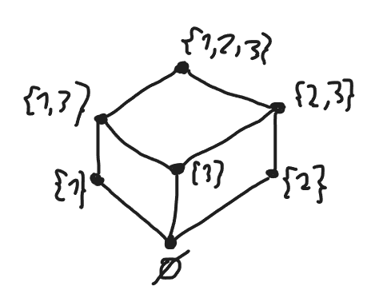
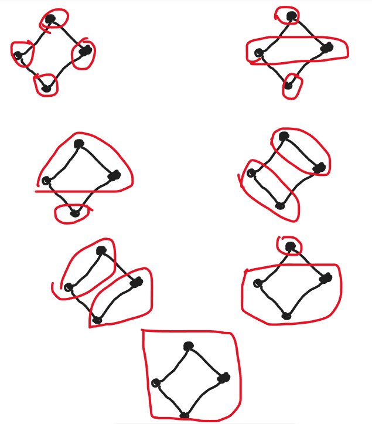
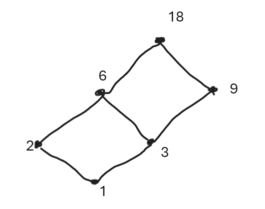
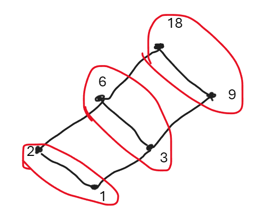
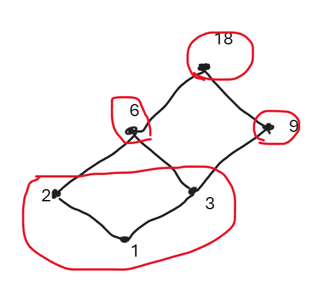
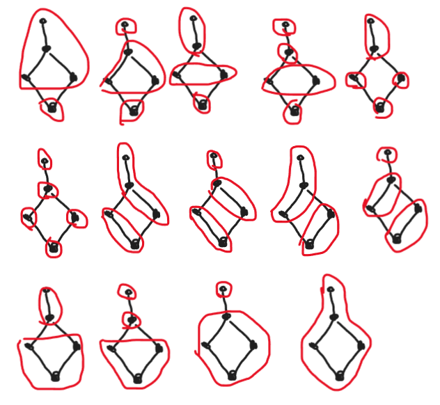
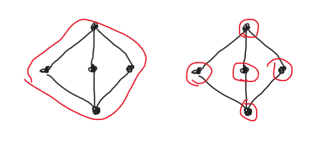

# Guía 4: ejercicios

## Ejercicio 1

### Item A

- Reflexividad (I1):
  - $a\ s\ a=\lfloor a+a\rfloor\neq a$ si $a\neq 0\Rightarrow$ NO
  - $a\ i\ a=\min\{a,a\}=a\Rightarrow$ SI
- Conmutatividad (I2, I3):
  - $a\ s\ b=\lfloor a+b\rfloor=\lfloor b+a\rfloor=b\ s\ a\Rightarrow$ SI
  - $a\ i\ s=\min\{a,b\}=\min\{b,a\}=b\ i\ a\Rightarrow$ SI
- Asociatividad (I4, I5):
  - $a\ s\ (b\ s\ c)=\lfloor a+\lfloor b+c\rfloor\rfloor\Rightarrow$ NO. Contraejemplo con $a=1,b=c=0.5$
  - $a\ i\ (b\ i\ c)=\min\{a\min\{b,c\}\}=\min\{a,b,c\}=\min\{\min\{a,b\},c\}=(a\ i\ b)\ c\Rightarrow$ SI
- Absorción (I6, I7):
  - $a\ s\ (a\ i\ b)=\lfloor a+\min\{a,b\}\rfloor\Rightarrow$ NO. Contraejemplo con $a=b=1$.
  - $a\ i\ (a\ s\ b)=\min\{a,\lfloor a+b\rfloor\}\Rightarrow$ NO. Contrajemplo con $a=1,b=-1$

### Item B

Básicamente $s$ es XOR $(\oplus)$ e $i$ es AND $(\wedge)$. Con ello, veamos:

- Reflexividad (I1):
  - $a\oplus a=0\forall a\Rightarrow$ NO por contraejemplo con $a=1$
  - $a\wedge a=a\Rightarrow$ SI
- Conmutatividad (I2, I3): Sabemos que sí
- Asociatividad (I4, I5): Sabemos que sí
- Absorción (I6, I7):
  - $a\oplus (a\wedge b)\Rightarrow$ NO. Contraejemplo con $a=b=1$
  - $a\wedge (a\oplus b)\Rightarrow$ NO. Contraejemplo con $a=b=1$

## Ejercicio 2

Vamos a demostrar de forma completa el **Teorema de Dedekind**, el cual dice que: Sea $(L,s,i)$ un reticulado terna, la relación binaria sobre $L$ definida por $x\leq y\iff x\ s\ y=y$ es un orden parcial sobre $L$ para el cual se cumple que $sup(\{x,y\})=x\ s\ y$ y que $inf(\{x,y\})=x\ i\ y\ \forall x,y\in L$.

Primero, demostremos que $\leq$ es reflexiva, transitiva y antisimétrica, suponiendo $x,y,z\in L$:

- Reflexividad: Por reflexividad de $s$ sabemos que $x\ s\ x=x$. Luego, por def., esto implica que $x\leq x$ por lo que se demuestra
- Transitividad: Digamos que $x\ s\ y=y$ y que $y\ s\ z=z$. Luego, esto significa que:
  $$
  \begin{aligned}
      (x\ s\ y)\ s\ (y\ s\ z)&=y\ s\ z\\
      x\ s\ (y\ s\ y)\ s\ z&=y\ s\ z&\text{ (Asociatividad)}\\
      x\ s\ y\ s\ z&=y\ s\ z&\text{ (Reflexividad)}\\
      x\ s\ (y\ s\ z)&=y\ s\ z&\text{ (Asociatividad)}\\
      x\ s\ z&=z&\text{ (Por suposición anterior)}\\
  \end{aligned}
  $$
  Ahora, por def. del orden parcial, tenemos que si $x\leq y$ y si $y\leq z$ entonces $x\leq z$, por lo que se cumple la transitividad.
- Antisimetría: Supongamos $x\ s\ y=y$ y que $y\ s\ x=x$. Luego, por conmutatividad sabemos que $x\ s\ y=y\ s\ x$ por lo que $x=y$. Por def. del orden parcial, esto significa que si $x\leq y$ y si $y\leq x$, entonces $x=y$, por lo que se cumple la antisimetría.

Ahora, ya habiendo demostrado por def. que $\leq$ es un orden parcial sobre $L$, tenemos que demostrar que $\forall x,y$ se cumple que $sup(\{x,y\})=x\ s\ y$ y que $inf(\{x,y\})=x\ i\ y$. Veamos ambos casos:

- $sup(\{x,y\})=x\ s\ y$:

  - Notemos que $x\ s\ y=x\ s\ x\ s\ y=x\ s\ (x\ s\ y)$ por reflexividad y asociatividad. Luego, por def. del orden parcial, tenemos que $x\leq x\ s\ y$. Del mismo modo, llegamos también a que $y\leq x\ s\ y$. Esto significa, entonces, que $x\ s\ y$ es una cota superior de $\{x,y\}$
  - Sea $z$ una cota superior de $\{x,y\}$, entonces $x\leq z\wedge y\leq z$, por lo que por def. del orden parcial tenemos que $x\ s\ z=z\wedge y\ s\ z=z$. Ahora, notemos que:
    $$
    \begin{aligned}
        (x\ s\ z)\ s\ (y\ s\ z)&=z\ s\ z\\
        (x\ s\ y)\ s\ (z\ s\ z)&=z\ s\ z&\text{Asociatividad y Conmutatividad}\\
        (x\ s\ y)\ s\ z&=z&\text{Reflexividad}\\
    \end{aligned}
    $$
    Luego, por def. del orden parcial, $x\ s\ y\leq z$, por lo que esto significa que es la menor cota superior de $\{x,y\}$

  Finalmente, entonces, esto significa por def. de supremo que $sup(\{x,y\})=x\ s\ y$.

- $inf(\{x,y\})=x\ i\ y$:

  - Notemos que $x\leq y\overset{def. \leq}{\iff}x\ s\ y=y\iff x\ i\ y\overset{prop.\ anterior}{=}x\ i\ (x\ s\ y)\overset{Absorción}{=}x$. Entonces, $x\leq y\iff x\ i\ y = x$ o, por conmutatividad, $y\ i\ x=x$ (def. alternativa del orden parcial).
  - Veamos que $x\ i\ y\overset{Reflexividad}{=}(x\ i\ x)\ i\ y=\overset{Asociatividad}{=}x\ i\ (x\ i\ y)$. Luego, por def. alternativa del orden parcial, $x\ i\ y\leq x$. Del mismo modo, llegamos a que $x\ i\ y\leq y$, por lo que por def. $x\ i\ y$ es una cota inferior de $\{x,y\}$
  - Sea $z$ una cota inferior de $\{x,y\}$, entonces por def. $z\leq x\wedge z\leq y$, por lo que por def. alternativa del orden parcial, $z\ i\ x=z\wedge z\ i\ y=z$. Ahora, notemos que:
    $$
    \begin{aligned}
        (z\ i\ x)\ i\ (z\ i\ y)&=z\ i\ z\\
        (x\ i\ y)\ i\ (z\ i\ z)&=z\ i\ z&\text{ Asocitatividad y Conmutatividad}\\
        (x\ i\ y)\ i\ z&=z&\text{Reflexividad}\\
    \end{aligned}
    $$
    Luego, por def. alternativa del orden parcial, tenemos que $z\leq x\ i\ y$, por lo que $x\ i\ y$ es la mayor cota inferior de $\{x,y\}$.

  Finalmente, entonces, esto significa que por la def. de ínfimo, $inf(\{x,y\})=x\ i\ y$.

Con todo ello, entonces, se demuestra el **Teorema de Dedekind** $\blacksquare$.

## Ejercicio 2,5

$$
\begin{aligned}
    \mathcal{F}:\{(L,\leq):(L,\leq)\text{ es reticulado par}\}&\to\{(L,s,i):(L,s,i)\text{ es reticulado terna}\}\\
    \mathcal{F}((L,\leq))&=(L,sup,inf)
\end{aligned}
$$

## Ejercicio 3

Es ver cuántos reticulados terna hay con universo $\{1,2,3\}$. Por el _Teorema de Dedekind_, es equivalente a ver la cantidad de reticulados pares con ese universo.

En total son $6$ las posibilidades de reticulados pares para este universo dado que su diagrama de Hasse es un "palito" (es decir, de la forma o-o-o).

## Ejercicio 4

Sea $(L,s,i)$ un reticulado terna, entonces su orden parcial asociado es $\leq=\{(x,y):x\ s\ y=y\}$. Ahora, si consideramos $\leq'=\{(x,y):(y,x)\in\leq\}=\{(x,y):x\ s\ y=x\}$, podemos notar que claramente es un orden parcial y se cumple que el supremo y el ínfimo de $(L,\leq)$ son el ínfimo y el supremo de $(L,\leq')$ respectivamente. Teniendo esto en cuenta, entonces $(L,\leq')$ es un reticulado par, de donde se llega a que $(L,i,s)$ es un reticulado terna. $\blacksquare$

Respecto a la relación entre los órdenes parciales asociados, notar que uno es el contrario del otro (excepto por la reflexividad, obvio).

## Ejercicio 5

### Item A

Falso. Como $s$ es una función, entonces un elemento de esta es una 2-UPLA.

### Item B

Verdadero. En particular no puede ser vacío por def. ya que ni sería un poset. Ahora, si $L$ tuviera más de un elemento, tendríamos que dados $x,y\in L:x\lt y$, entonces $x\ s\ y=y$. Sin embargo, como $s$ también es el ínfimo, tendríamos que $x\ s\ y=x$, por lo que $x=y$ y se llega a un absurdo.

Finalmente, $|L|=1$.

### Item C

Impreciso. El orden parcial asociado a $s,i$ depende del tipo de los elementos de $L$, por lo que no siempre marca una relación entre $s$ e $i$ (solo cuando los elementos de $L$ son conjuntos).

### Item D

Impreciso. $s:L^2\to L$, por lo que no tiene sentido.

## Ejercicio 6

### Item A

Notemos que, sean $x,y,z\in\mathbb{R}$, $x\ i\ (y\ s\ z)=\min(x,\max(y,z))$. Ahora, es sencillo notar que esto es igual a $\max(\min(x,y),\min(x,z))=(x\ i\ y)\ s\ (x\ i\ z)$ dado que:

- Si $inf(\{x,y,z\})=x$, entonces claramente la 1era devuelve $x$ y en la segunda nos queda $\max(x,x)=x$.
- Si $inf(\{x,y,z\})=y$, entonces en la 1era nos queda $\min(x,z)$. Respecto a la segunda, tendríamos $\max(y,\min(x,z))$, pero al ser $y$ el más chico, claramente queda $\min(x,z)$
- Si $inf(\{x,y,z\})=z$, es análogo a lo anterior.

Con ello, se demuestra que $x\ i\ (y\ s\ z)=(x\ i\ y)\ s\ (x\ i\ z)$, por lo que $(\mathbb{R},\max,\min)$ es distributivo $\blacksquare$.

### Item B

Sean $X,Y,Z\in\mathcal{P}(\mathbb{N})$, es trivial ver que $X\ i\ (Y\ s\ Z)=(X\ i\ Y)\ s\ (X\ i\ Z)$ dado que es lo mismo que $X\cap (Y\cup Z)=(X\cap Y)\cup (X\cap Z)$, lo cual es una propiedad de conjuntos que ya conocemos $\blacksquare$.

## Ejercicio 7

Es claro de ver que $(\{1,2,3,5,30\},s,i)$ no es un reticulado terna distributivo dado que $2\ i\ (3\ s\ 5)=2\ i\ 30=2$ pero $(2\ i\ 3)\ s\ (2\ i\ 5)=1\ s\ 1=1$. $\blacksquare$

## Ejercicio 8

Notemos que $L=\{\emptyset,\{1\},\{2\},\{3\},\{2,3\},\{1,3\},\{1,2,3\}\}$

### Item A

### Item B

Porque tiene esa forma el diagrama de Hasse

### Item C

No sé a qué se refiere el enunciado

### Item D

No es distributivo dado que $\{2,3\}\ i\ (\{1\}\ s\ \{2\})=\{2,3\}\ i\ \{1,2,3\}=\{2,3\}$ pero $(\{2,3\}\ i\ \{1\})\ s\ (\{2,3\}\ i\ \{2\})=\emptyset\ s\ \{2\}=\{2\}$.

## Ejercicio 9

### Item A

Los subuniversos de $(\mathcal{P}(\{1,2\}),\cup,\cap)$ son $\mathcal{P}(\{1,2\})-\{\emptyset\}$

### Item B

Los subuniversos de $(\{1,2,3,6,12\},mcm,mcd)$ son $\left[\{\{1,2,3,6,12\},\{1,2,3,6\}\}\cup\mathcal{P}(\{1,2,6,12\})\cup\mathcal{P}(\{1,3,6,12\})\right]-\{\emptyset\}$, siendo $2+2^4+2^3-1=25$ en total.

Los subreticulados terna correspondientes son $(L,mcm,mcd)\forall L\in\{\{1,2,3,6,12\},\{1,2,3,6\}\}$ y $(L',\max,\min)\forall L'\in\left[\mathcal{P}(\{1,2,6,12\})\cup\mathcal{P}(\{1,3,6,12\})\right]-\{\emptyset\}$.

### Item C

Los subuniversos de $(\mathbb{R},\max,\min)$ son $\mathcal{P}(\mathbb{R})-\{\emptyset\}$.

## Ejercicio 9,5

En el caso de los subuniversos de $(\mathcal{\mathbb{N}},\cup,\cap)$ con tres elementos, tenemos que son "palitos" en su diagrama de Hasse. Es decir, sean $X,Y,Z$ los elementos, $X\subset Y\subset Z$.

En el caso de cuatro elementos, tenemos los "palitos" y también el rombo. Este último se describe de la siguiente forma: sean $X,Y,W,Z$ los elementos, entonces $X\subset Y\subset W,X\subset Z\subset W$.

## Ejercicio 9,7

Es la misma idea que los anteriores para resolverlo.

## Ejercicio 10

### Item A

Verdadero

### Item B

Falso. Ya que no es cerrado en $s$ porque $2\ s\ 3=6\notin\{1,2,3,12\}$

### Item C

Falso. $Ti(S)=\text{CONJUNTO}$

### Item D

Verdadero. Como $S_1,S_2$ son subuniversos de $(L,s,i)$, entonces son cerrados por $s,i$. Luego, esto significa que:

- $\forall x,y\in S_1,x\ s\ y\in S_1$
- $\forall x,y\in S_2,x\ s\ y\in S_2$

Ahora, si tenemos $x,y\in S_1\cap S_2$, por lo anterior sabemos que $x\ s\ y\in S_1$ y que $x\ s\ y\in S_2$, por lo que $x\ s\ y\in S_1\cap S_2$. Luego, $S_1\cap S_2$ es cerrado bajo $s,i$, por lo que es un subuniverso de este reticulado terna.

### Item E

Falso. Por contraejemplo considerando $(\{1,2,3,6\},|)$, $S_1=\{2\}$ y $S_2=\{3\}$, ya que claramente $\{2,3\}$ no es cerrado por $mcm$ ni $mcd$.

### Item F

Verdadero. Porque $L\subseteq L'$ en particular.

### Item G

Falso. Simplemente tomar un ejemplo de los anteriores que no sea distributivo, y considerar un subreticulado con universo $\{x\}:x\in L'$, el cual sí es distributivo siempre.

### Item H

Impreciso. No está definida la intersección para 3-UPLAS. Eso es para elementos de tipo CONJUNTO.

### Item I

Verdadero. Como $\leq$ es el orden asociado de $(L,s,i)$, por def. $x\leq y\iff x\ s\ y=y\iff x\ i\ y=x$.

Ahora, $\leq\cap S^2=\{(x,y):x\ s\ y=y\wedge x,y\in S\}$. Como $(S,\leq\cap S^2)$ es un reticulado par, entonces está definido el supremo y el ínfimo para todo par de elementos de $S$. Luego, es claro ver que $x\ \hat{s}\ y\in S$ y que $x\ \hat{i}\ y\in S$ para $x,y\in S$, por lo que es cerrado en $S$ bajo $\hat{s},\hat{i}$. Luego, por def. $(S,\hat{s},\hat{i})$ es subreticulado terna de $(L,s,i)$.

## Ejercicio 11

Vamos a probar el lema que dice que: Si $F:(L,s,i)\to(L',s',i')$ es un homomorfismo biyectivo, entonces $F$ es un isomorfismo.

Como $F$ es un homomorfismo biyectivo, entonces solo tenemos que demostrar que $F^{-1}$ es un homomorfismo para ver que $F$ es un isomorfismo.

Por ello mismo, entonces, notemos que por def. de homomorfismo, sean $x,y\in L$ se cumple que $F(x\ s\ y)=F(x)\ s'\ F(y)$. Si aplicamos la inversa a ambos lados tenemos $F^{-1}(F(x\ s\ y))=x\ s\ y=F^{-1}(F(x))\ s\ F^{-1}(F(y))=F^{-1}(F(x)\ s'\ F(y))$. Ahora, sean $a=F(x),b=F(y)\in L'$, entonces es lo mismo que $F^{-1}(a\ s'\ b)=F^{-1}(a)\ s\ F^{-1}(b)$.

Teniendo esto último en cuenta, como $F$ es biyectiva, esto implica que existe una relación uno-a-uno entre los elementos de los reticulados terna, por lo que $\forall a,b\in L',F^{-1}(a\ s'\ b)=F^{-1}(a)\ s\ F^{-1}(b)$. De forma análoga llegamos a lo mismo pero con los ínfimos. Luego, entonces, por def. $F^{-1}$ es un homomorfismo.

Finalmente, al ser $F$ un homomorfismo biyectivo con $F^{-1}$ homomorfismo, por def. $F$ es un isomorfismo, por lo que $(L,s,i)\cong (L',s',i')$. $\blacksquare$

## Ejercicio 12

Vamos a probar el lema que dice que: Sean $(L,s,i),(L',s',i')$ reticulados terna, $(L,\leq),(L',\leq')$ los posets asociados y $F:L\to L'$ una función, entonces $F$ es un isomorfismo de $(L,s,i)$ en $(L',s',i')\iff F$ es un isomorfismo de $(L,\leq)$ en $(L',\leq')$.

Veamos que $F$ isomorfismo de $(L,s,i)$ en $(L',s',i')\overset{\text{def. isomorfismo}}{\iff} F$ es homomorfismo biyectivo y $F^{-1}$ es un homomorfismo $\overset{\text{def. homomorfismo}}{\iff}\forall x,y\in L,F(x\ s\ y)=F(x)\ s'\ F(y)\wedge F(x\ i\ y)=F(x)\ i'\ F(y)$.

Ahora, con esto en cuenta, notemos que sean $x,y\in L$, entonces $x\leq y\iff x\ s\ y=y\wedge x\ i\ y=x\iff F(y)=F(x)\ s'\ F(y)\wedge F(x)=F(x)\ i'\ F(y)\iff x\leq' y$. Luego, por def. llegamos a que $F$ es un isomorfismo de $(L,\leq)$ en $(L',\leq')$ por def. dado que es biyectiva y $F,F^{-1}$ son homomorfismos. $\blacksquare$

## Ejercicio 12,3

Vamos a demostrar que si $F:(L,s,i)\to (L',s',i')$ es un homomorfismo suryectivo y $(L,s,i)$ es distributivo, entonces $(L',s',i')$ es distributivo.

Para ver esto, digamos que tenemos $x,y,z\in L'$. Como $F$ es suryectiva, $\exists a,b,c\in L:x=F(a),y=F(b),z=F(c)$. Luego, notemos que:

$$
\begin{aligned}
    x\ i'\ (y\ s'\ z)&=F(a)\ i'\ (F(b)\ s'\ F(c))\\
    &=F(a)\ i'\ F(b\ s\ c)&\text{(def. homomorfismo)}\\
    &=F(a\ i\ (b\ s\ c))&\text{(def. homomorfismo)}\\
    \\
    (x\ i'\ y)\ s'\ (x\ i'\ z)&=(F(a)\ i'\ F(b))\ s'\ (F(a)\ i'\ F(c))\\
    &=F(a\ i\ b)\ s'\ F(a\ i\ c)&\text{(def. homomorfismo)}\\
    &=F((a\ i\ b)\ s\ (a\ i\ c))&\text{(def. homomorfismo)}\\
\end{aligned}
$$

Con ello, entonces, tenemos que si $(L,s,i)$ es distributivo, entonces $a\ i\ (b\ s\ c)=(a\ i\ b)\ s\ (a\ i\ c)$, por lo que $x\ i'\ (y\ s'\ z)=(x\ i'\ y)\ s'\ (x\ i'\ z)$, por lo que por def. $(L',s',i')$ es distributivo. $\blacksquare$

Respecto al caso del isomorfismo, como $F,F^{-1}$ son homomorfismos suryectivos, entonces tenemos que:

$$
\begin{aligned}
    (L,s,i)\text{ distributivo}&\Rightarrow (L',s',i')\text{ distributivo}\\
    (L',s',i')\text{ distributivo}&\Rightarrow (L,s,i)\text{ distributivo}\\
\end{aligned}
$$

Por lo que $(L,s,i)\text{ distributivo}\iff (L',s',i')\text{ distributivo}\\$ $\blacksquare$.

## Ejercicio 12,6

Notemos que si $F$ es un homomorfismo suryectivo entre los reticulados terna, entonces con la misma idea del lema $4$ llegamos a que $F$ es un homomorfismo suryectivo de los posets asociados. Luego, como los posets asociados $(L,\leq),(L',\leq')$ cumplen que si $a$ es máximo de $(L,\leq)$ entonces $F(a)$ es máximo de $(L',s',i')$, podemos demostrar esta propiedad. $\blacksquare$

## Ejercicio 13

Entre (a) y (b).

## Ejercicio 14

Notemos que $\overset{\sim}{s}$ no es ambigua dado que tenemos:

$$
\begin{aligned}
  x/\theta\ \overset{\sim}{s}\ y/\theta&=\{x'\in L:x\theta x'\}\ \overset{\sim}{s}\ \{y'\in L:y\theta y'\}&\text{ por def.}\\
  &=\{x'\ \overset{\sim}{s}\ y':x',y'\in L\wedge x\theta x'\wedge y\theta y'\}\\
  &=\{x'\ \overset{\sim}{s}\ y':x',y'\in L\wedge (x\ s\ y)\theta (x'\ s\ y)\}&\text{ por prop. (1)}\\
  &=(x\ s\ y)/\theta&\text{ por def.}
\end{aligned}
$$

Del mismo modo, mostramos que $\overset{\sim}{i}$ tampoco es ambigua.

## Ejercicio 15

La idea es hacerlo con los diagramas de Hasse y luego darlos de forma explícita:

Con ello, podemos ver las siguientes congruencias (dadas por la partición):

- $\{\{\emptyset\},\{\{a\}\},\{\{b\}\},\{\{a,b\}\}\}$ cuyo reticulado terna cociente es isomorfo a $(\{1,2,3,6\},mcm,mcd)$.
- $\{\{\emptyset\},\{\{a\},\{b\}\},\{\{a,b\}\}\}$ cuyo reticulado terna cociente es isomorfo a $(\{1,2,3\},\max,\min)$
- $\{\{\emptyset\},\{\{a\},\{b\},\{a,b\}\}\}$ cuyo reticulado terna cociente es isomorfo a $(\{1,2\},\max,\min)$
- $\{\{\emptyset,\{a\}\},\{\{b\},\{a,b\}\}\}$ cuyo reticulado terna cociente es isomorfo a $(\{1,2\},\max,\min)$
- $\{\{\emptyset,\{a\},\{b\}\},\{\{a,b\}\}\}$ cuyo reticulado terna cociente es isomorfo a $(\{1,2\},\max,\min)$
- $\{\{\emptyset,\{a\},\{b\},\{a,b\}\}\}$ cuyo reticulado terna cociente es isomorfo a $(\{1\},\max,\min)$

## Ejercicio 15,5

### Item A

### Item B

Tiene sentido porque el diagrama de Hasse con la congruencia nos queda así:

### Item C

$(L,mcm,mcd)/\theta=(\{\{1,2\},\{3,6\},\{9,18\}\},\overset{\sim}{s},\overset{\sim}{i})$ donde:

- $\{1,2\}\ \overset{\sim}{s}\ \{3,6\}=\{3,6\}$ y $\{1,2\}\ \overset{\sim}{i}\ \{3,6\}=\{1,2\}$
- $\{1,2\}\ \overset{\sim}{s}\ \{9,18\}=\{9,18\}$ y $\{1,2\}\ \overset{\sim}{i}\ \{9,18\}=\{1,2\}$
- $\{3,6\}\ \overset{\sim}{s}\ \{9,18\}=\{9,18\}$ y $\{3,6\}\ \overset{\sim}{i}\ \{9,18\}=\{3,6\}$

### Item D

$$
\begin{aligned}
  \overset{\sim}{\leq}=\{(\{1,2\},\{1,2\}),(\{1,2\},\{3,6\}),(\{1,2\},\{9,18\}),\\
  (\{3,6\},\{3,6\}),(\{3,6\},\{9,18\}),(\{9,18\},\{9,18\})\}
\end{aligned}
$$

### Item E

El isomorfismo está dado por:

$$
\begin{aligned}
  \{1,2\}\leftrightarrow 0\\
  \{3,6\}\leftrightarrow 1\\
  \{9,18\}\leftrightarrow 2
\end{aligned}
$$

### Item F

La congruencia $\delta$ está dada por la partición $\{\{1,2,3\},\{6\},\{9\},\{18\}\}$ cuyo diagrama de Hasse es:

Y que, claramente, es isomorfo al rombo de $(\mathcal{P}(\{a,b\}),\cup,\cap)$.

## Ejercicio 16

Queremos demostrar la siguiente propiedad: Sea $(L,s,i)$ un reticulado terna cuyo máximo es $1$, entonces si $\theta$ es una congruencia sobre $(L,s,i)$, $1/\theta$ es el máximo de $(L,s,i)/\theta$.

Para ver esto, notemos que como $1$ es el máximo de $(L,s,i)$, entonces significa que $x\leq 1\forall x\in L$. Ahora, por def. del orden asociado, sabemos que eso implica que $x\ s\ 1=1\forall x\in L$.

Luego, sea $\theta$ la congruencia y sea $y\in L$, por def. de congruencia sabemos que $y/\theta\ s\ 1/\theta=(y\ s\ 1)/\theta=1/\theta$ (por lo visto antes). Ahora, por def. del orden asociado a un reticulado terna, esto claramente implica que $y/\theta\overset{\sim}{\leq} 1/\theta$. Como esto se hizo $\forall y\in L$, quiere decir por def. que $1/\theta$ es el máximo del cociente. $\blacksquare$

## Ejercicio 17

Por el ejercicio anterior, y haciéndolo de forma análoga para el ínfimo, tenemos que $1/\theta$ y $0/\theta$ son el máximo y el mínimo, respectivamente, del cociente de $(L,s,i)$. Con ello, por def. de congruencia, como $(0,1)\in\theta$, entonces $0/\theta=1/\theta$.

Ahora, como son mínimo y máximo, tenemos que $\forall x\in L,0/\theta\overset{\sim}{\leq}x/\theta\overset{\sim}{\leq}1/\theta$, pero como $0/\theta=1/\theta$, entonces $x/\theta=0/\theta=1/\theta\forall x\in L$. Luego, esto quiere decir que $x\theta y\forall x,y\in L$, por lo que $\theta=L^2$ y se demuestra. $\blacksquare$

## Ejercicio 18

Vamos a demostrar el lema que dice que: Si $F:(L,s,i)\to (L',s',i')$ es un homomorfismo, entonces $ker(F)$ es una congruencia sobre $(L,s,i)$.

Para demostrar que $\theta=ker(F)$, tenemos que demostrar que dados $x,x',y,y'\in L$, entonces $x\theta x'\wedge y\theta y'\Rightarrow (x\ s\ y)\theta (x'\ s\ y')$. Por ello, digamos que tenemos estos $x,x',y,y'\in L$ que cumplen la precondición y veamos que, como $ker(F)=\{(a,b)\in L^2:F(a)=F(b)\}$, entonces $F(x)=F(x')$ y $F(y)=F(y')$.

Teniendo esto último en cuenta, entonces:

$$
\begin{aligned}
  F(x\ s\ y)&=F(x)\ s'\ F(y)&\text{def. de homomorfismo}\\
  &=F(x')\ s'\ F(y')&\text{lo visto antes}\\
  &=F(x'\ s\ y')&\text{def. de homomorfismo}
\end{aligned}
$$

Luego, como $F(x\ s\ y)=F(x'\ s\ y')$, entonces $(x\ s\ y)\theta(x'\ s\ y')$ por lo que se demuestra que $\theta=ker(F)$ es una congruencia de $(L,s,i)$. $\blacksquare$.

## Ejercicio 19

Las posibles congruencias de este reticulado terna las podemos ver gráficamente como particiones en el diagrama de Hass:

## Ejercicio 20

En el caso del diamante, tenemos las siguientes dos posibles congruencias nomás:

## Ejercicio 21

Vamos a demostrar la propiedad que dice que: Sea $\theta$ una congruencia del reticulado terna $(L,s,i)$, entonces:

- Si $c\in L/\theta$, entonces $c$ es un subuniverso de $(L,s,i)$
- Si $c\in L/\theta$, entonces $c$ es un subconjunto convexo de $(L,s,i)$. Es decir, que $\forall x,y,z\in L$, $((x,y\in c\wedge x\leq z\leq y)\Rightarrow z\in c)$.

### Item A

Digamos $x,y\in c$. Como $c\in L/\theta$ y $\theta$ es una congruencia de $(L,s,i)$, entonces $x\theta y$. Ahora, como obviamente $x\theta x$, por definición de congruencia tenemos que $(x\ s\ x)\theta(x\ s\ y)$ y que $(x\ i\ x)\theta(x\ i\ y)$ por lo que por reflexividad de $s,i$ llegamos a que $x\theta(x\ s\ y)$ y $x\theta(x\ i\ y)$. Finalmente, esto implica que $(x\ s\ y),(x\ i\ y)\in c$, por lo que $c$ es cerrado por $s,i$ y por def. es un subuniverso de $(L,s,i)$. Con esto, se demuestra. $\blacksquare$

### Item B

Sean $x,y,z\in L:x\leq z\leq y\wedge x,y\in c$ donde $c\in L/\theta$, entonces por def. del orden parcial asociado a $(L,s,i)$ tenemos que $x\ s\ z=z\wedge z\ s\ y=y$.

Teniendo esto en cuenta, como $x\theta y\wedge z\theta z$, como $\theta$ es una congruencia de $(L,s,i)$, entonces por def. se cumple que $(x\ s\ z)\theta(y\ s\ z)$. Luego, tomando el resultado anterior, esto es lo mismo que $z\theta y$, por lo que $z/\theta=y/\theta=x/\theta$ y, por ende, $z\in c$ demostrándose, así, que $c$ es un subconjunto convexo de $(L,s,i)$. $\blacksquare$

## Ejercicio 22

### Item A

Verdadero. Trivial de ver si consideramos $\delta$ dado por la partición $\{S\}\cup(\bigcup_{x\in L:x\notin S}\{x\})$, la cual claramente es una congruencia de $(L,s,i)$.

### Item B

Verdadero. Vamos a hacer la demostración formal a continuación.

Vamos a demostrar la propiedad que dice: Sea $(L,s,i)$ un reticulado terna distributivo y $\theta$ una congruencia sobre él, entonces su cociente es distributivo.

Para ello, sean $a,b,c\in L/\theta$, sabemos que $\exists x,y,z\in L:a=x/\theta,b=y/\theta,c=z/\theta$. Luego, veamos que:

$$
\begin{aligned}
  a\ \overset{\sim}{i}\ (b\ \overset{\sim}{s}\ c)&=x/\theta\ \overset{\sim}{i}\ (y/\theta\ \overset{\sim}{s}\ z/\theta)\\
  &=x/\theta\ \overset{\sim}{i}\ (y\ s\ z)/\theta&\text{prop. de congruencia}\\
  &=(x\ i\ (y\ s\ z))/\theta&\text{prop. de congruencia}\\
  &=((x\ i\ y)\ s\ (x\ i\ z))/\theta&\text{distributividad de }(L,s,i)\\
  &=(x\ i\ y)/\theta\ \overset{\sim}{s}\ (x\ i\ z)/\theta&\text{prop. de congruencia}\\
  &=(x/\theta\ \overset{\sim}{i}\ y/\theta)\ \overset{\sim}{s}\ (x/\theta\ \overset{\sim}{i}\ z/\theta)&\text{prop. de congruencia}\\
  &=(a\ \overset{\sim}{i}\ b)\ \overset{\sim}{s}\ (a\ \overset{\sim}{i}\ c)
\end{aligned}
$$

Finalmente, entonces, por def. tenemos que $(L/\theta,\overset{\sim}{s},\overset{\sim}{i})=(L,s,i)/\theta$ es distributivo, por lo que se demuestra. $\blacksquare$

### Item C

Falso. Es trivial ver que no es cierto si se considera la partición dada por $\{L\}$ y $u=0$ siendo $|L|\gt 1$.

## Ejercicio 23

Vamos a demostrar la propiedad que dice que: Sea $(L,s,i)$ un reticulado terna y $\theta$ una congruencia de $(L,s,i)$, entonces dados $c,c'\in L/\theta$ se cumple que $c\overset{\sim}{\leq}c'\iff\exists x\in c\wedge y\in c':x\leq y$.

Para demostrarlo, vamos a ver los dos casos del sii:

- Caso $\Rightarrow$: Sean $c,c'\in L/\theta:c\overset{\sim}{\leq}c'$, por def. del orden parcial, significa que $c\ \overset{\sim}{s}\ c'=c'$. Ahora, como $\exists x,y\in L:x/\theta=c\wedge y/\theta=c'$, es claro notar que $x\in c,y\in c'$. Luego, tenemos que $x/\theta\ \overset{\sim}{s}\ y/\theta=(x\ s\ y)/\theta$ por def. de congruencia, lo que significa que $y/\theta=(x\ s\ y)/\theta$. Veamos los posibles casos:

  - Si $x\theta y$, o bien $x\leq y$ o bien $y\leq x$, pero se cumple dado que $c=c'$ y $x,y\in c$.
  - Sino, es claro que $y=x\ s\ y$, lo que implica que $x\leq y$.

  Con ello, se demuestra la ida. $\blacksquare$

- Caso $\Leftarrow$: Sean $c,c'\in L:(\exists x,y\in L:c=x/\theta\wedge c'=y/\theta\wedge x\leq y)$, entonces por def. del orden parcial asociado, $x\ s\ y=y$. Luego, claramente significa que $(x\ s\ y)/\theta=y/\theta$. Por propiedad de congruencia, llegamos a que $y/\theta=(x\ s\ y)/\theta=x/\theta\ \overset{\sim}{s}\ y/\theta$. Luego, por def. del orden parcial asociado, $x/\theta\overset{\sim}{\leq}y/\theta$, por lo que $c\overset{\sim}{\leq}c'$ y se demuestra la vuelta. $\blacksquare$

Habiendo demostrado ida y vuelta, se demuestra la propiedad por completo. $\blacksquare$
